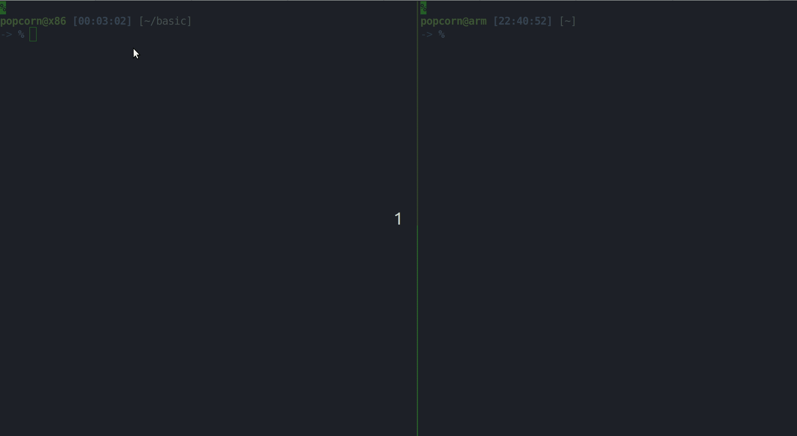
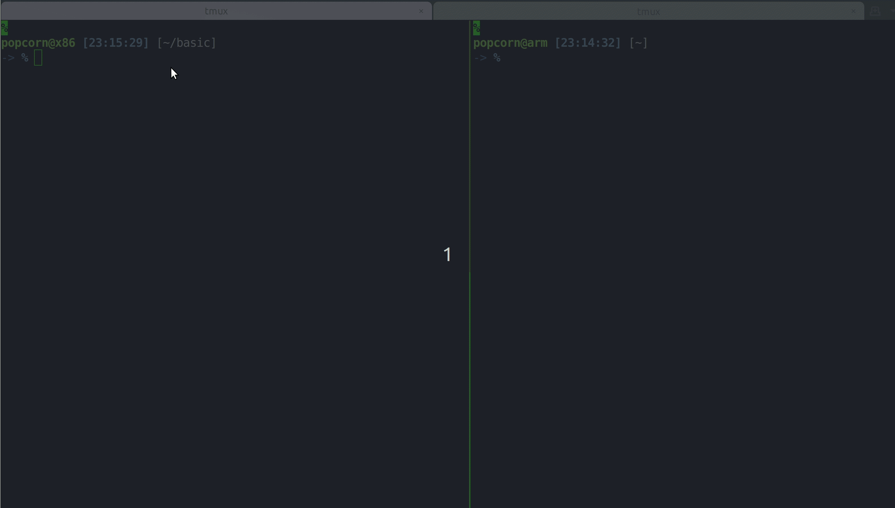

# HeterSec - Software diversification using ISA heterogeneity
---
## Overview
HeterSec is a framework that enables application software diversification using ISA heterogeneity. It runs diversified processes on top of off-the-shelf commodity machines of different ISAs (e.g., x86-64, AArch64). HeterSec hides the complex differences between ISAs including that between instructions, memory layout, registers, and ABIs, among others, and makes it easier to build and launch ISA-diversified application instances. To demonstrate HeterSec's objectives, the project has developed prototypes of two techniques that use ISA heterogeneity for software diversification as proofs-of-concept: multi-ISA-based moving target defense (MTD) and multi-ISA-based multi-version execution (MVX).

The work is published at RAID 2020 ([raid20.pdf](https://www.ssrg.ece.vt.edu/papers/raid20.pdf)).

---
## Requirement
We can run HeterSec on real x86_64 and arm64 machines connected using ConnectX-4 InfiniBand. However, it's easier to set up the environment with QEMU VMs. Here we demonstrate how to run HeterSec on QEMU VMs.

i) Install dependency packages:
```
$ sudo apt-get update
$ sudo apt-get install build-essential libssl-dev libncursesw5-dev git curl bc bridge-utils
$ sudo apt-get install qemu-system-x86 qemu-system-arm
```
ii) Download QEMU images:
- x86 VM image (4GB): https://drive.google.com/open?id=0B7RfKPGm2YZsaURxTVh5ZTMyTk0
- arm VM image (2GB): https://drive.google.com/open?id=0B7RfKPGm2YZsaF9rdkZTLVAxX3M

iii) Configure host network

Follow this [link](https://github.com/ssrg-vt/popcorn-kernel/wiki/VM-Setup#set-up-the-host-network-interface) to set up the host network.

---
## Setup
### Build the kernels
Clone the souce code:
```
$ git clone --recursive https://github.com/ssrg-vt/HeterSec.git
```
Make a copy of the kernel source:
```
$ cd HeterSec/src
$ cp -r hetersec-kernel hetersec-kernel-arm64
```
Build the x86_64 kernel and arm64 kernel respectively:
```
$ cp hetersec-kernel/kernel/popcorn/configs/config-x86_64-qemu hetersec-kernel/.config
$ make -C hetersec-kernel -j8
$ cp hetersec-kernel-arm64/kernel/popcorn/configs/config-arm64-qemu hetersec-kernel-arm64/.config
$ ARCH="arm64" make -C hetersec-kernel-arm64 -j8
```

### Boot the VMs
Boot the VMs with newly built kernel:
```
$ sudo qemu-system-x86_64 \
    -enable-kvm -cpu host -smp 2 -m 4096 -no-reboot -nographic \
    -drive id=root,media=disk,file=x86.img \
    -net nic,macaddr=00:da:bc:de:00:13 -net tap \
    -kernel hetersec-kernel/arch/x86/boot/bzImage \
    -append "root=/dev/sda1 console=ttyS0" \
    -pidfile vm0.pid 2>&1 | tee vm0.log

$ sudo qemu-system-aarch64 \
    -machine virt -cpu cortex-a57 -m 4096 -nographic \
    -drive id=root,if=none,media=disk,file=arm.img \
    -device virtio-blk-device,drive=root \
    -netdev type=tap,id=net0 \
    -device virtio-net-device,netdev=net0,mac=00:da:bc:de:02:11 \
    -kernel hetersec-kernel-arm64/arch/arm64/boot/Image \
    -append "root=/dev/vda console=ttyAMA0" \
    -pidfile vm1.pid 2>&1 | tee vm1.log
```
### Kernel message layer:
Build the message layer kernel modules and copy them to the corresponding VMs:
```
$ make -C hetersec-kernel/msg_layer
$ ARCH="arm64" make -C hetersec-kernel-arm64/msg_layer/
$ scp hetersec-kernel/msg_layer/msg_socket.ko popcorn@[x86-VM-IP]:~
$ scp hetersec-kernel/msg_layer/msg_socket.ko popcorn@[arm-VM-IP]:~
```
Setup the nodes information (in `/etc/popcorn/nodes`) and install the `msg_socket.ko` on each VM:
```
[x86 VM] ~ $ cat /etc/popcorn/nodes
10.2.0.2
10.2.1.2
[arm VM] ~ $ cat /etc/popcorn/nodes
10.2.0.2
10.2.1.2
```
```
[x86 VM] ~ $ sudo install msg_socket.ko
[arm VM] ~ $ sudo install msg_socket.ko
```
Now you are ready to run the applications.

## Test cases
### Build MTD application binaries
Please see detailed instructions [here](test/mtd/README.md).

Alternatively, we have also pre-built the test cases for multi-ISA MTD. You can just copy the pre-built binaries (in `test/pre-built`) to your target machines (VMs). More detailed instruction can be found [here](test/mtd/pre-built/README.md).

To start the MTD process, we need to configure a list of potential migration points. More instructions can be found [here](test/mtd/README.md#create-configuration-files-to-control-the-execution-randomness).
### Build MVX application binaries
1. Make sure the musl-libc (from the *same source code*) is installed on both VMs (assume it is in `/usr/local/musl`)
2. Copy the `HeterSec/test/mvx` to both VMs.
3. run `make`

### Running test cases (demos)
- Randomly executing code on nodes with different ISA (multi-ISA MTD):



- Running code on two ISA-different nodes (multi-ISA MVX):

To start the MVX variants, you need to use a issue a HeterSec system call to make the process as MVX process. We prepared a shared library, you can run the variant from the ARM node by executing `LD_PRELOAD=./loader.so <bin>`
